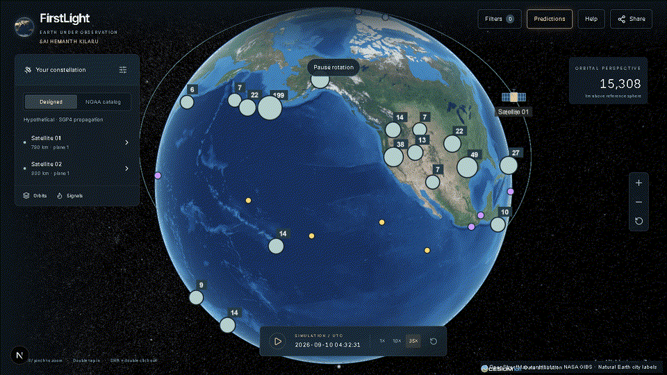
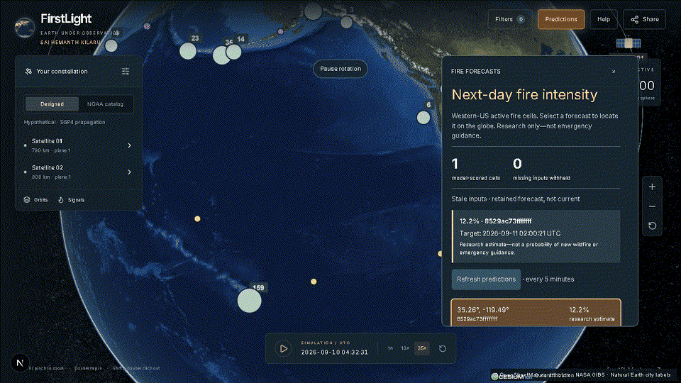

# FirstLight — Earth Under Observation

**Designed and built by SAI HEMANTH KILARU**

FirstLight brings reported natural events, satellite-orbit simulation, and experimental fire forecasts into one interactive globe. Move from orbit to a place, select an event, and inspect its source and observation time without leaving the map.

## Explore the globe

The animation is a recording of the application, not a rendered concept. The slow idle globe rotation is a presentation effect, independent of the simulation clock. Satellite motion is simulated, not live spacecraft telemetry. Provider outages and stale-data messages are deliberately shown rather than hidden.

## Inspect a research forecast

Selecting a forecast keeps its score, target time, and research warning in the prediction workspace. Compact Filters and Help controls keep the globe accessible without a permanent long sidebar.

- Browse wildfire reports, earthquakes, US weather alerts, and cyclone reports.
- Filter available event history by date; provider coverage and retention differ.
- Inspect original source links and timestamps.
- Explore modeled satellite access, separately from observed events.
- Select research fire forecasts to locate the corresponding western-US H3 cell.

## The data and model

Public feeds include NASA EONET, USGS, NWS, GDACS, and NOAA space weather. The experimental fire model uses NOAA GOES-18 observations and Open-Meteo weather. It passed its August 2024 chronological and geographic ranking gates; current-year performance remains unvalidated and recall is limited. It does not predict earthquake occurrence, wildfire ignition, or fire spread.

The interface checks feeds every five minutes while open. Provider publication times vary. Hosted prediction-job cadence is a separate deployment setting; this showcase does not promise five-minute model updates.

## Source availability and attribution

These recordings play at half speed with 25-FPS blended interpolation for smoother viewing. They show a local development session, not measured rendering performance or proof of a hosted prediction service. Branding has since been refined.

See [backend deployment requirements](DEPLOYMENT.md). GitHub stores code; a separate host must run the Python API and prediction jobs.

See [project overview](OVERVIEW.md) and the intentionally limited [camera-motion sample](samples/explorer-motion.ts). This is a portfolio showcase, not the full application source.

The implementation repository is private. This document and its GIFs can be shared separately without sharing source files or model artifacts. A public website necessarily delivers its frontend JavaScript and assets to visitors; private hosting does not make that browser-delivered material secret.

© 2026 SAI HEMANTH KILARU. Original FirstLight code, interface, writing, and recording: all rights reserved, except where separate licenses apply. Public datasets, map imagery, and libraries retain their respective licenses and attribution requirements. Portfolio research only—not emergency guidance.
