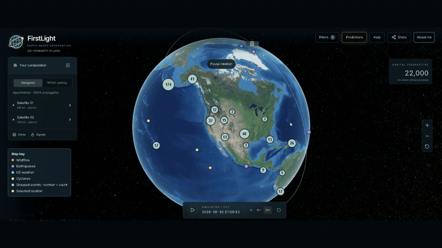
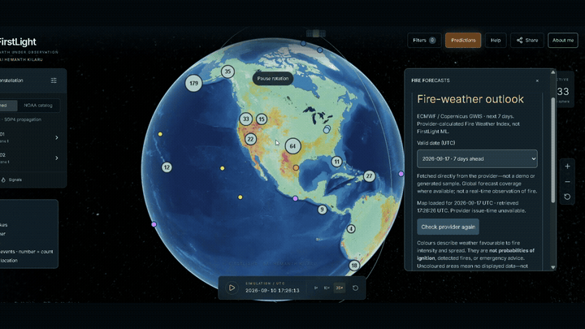

# FirstLight

Earth Under Observation

Explore reported natural events, replay their history, and compare fire-weather forecasts on an interactive globe.

[Open FirstLight](https://firstlight-sai-hemanth-kilaru-geo-vercel.vercel.app/) · [Watch the one-minute demo](media/firstlight-demo.mp4)

## Explore

- **Events:** wildfire reports, earthquakes, US weather alerts, and cyclones—with source links and timestamps.
- **History:** filter dates and replay available reports.
- **Forecasts:** seven-day ECMWF / Copernicus GWIS fire-weather danger.
- **Spatial context:** modeled satellite passes and on-demand OSM 3D buildings where available.

Recorded September 10, 2026. These clips show captured data, not current conditions.

## Under the hood

Next.js · TypeScript · CesiumJS · H3 · Python / FastAPI · Docker

Built with free-access data and free-tier hosting. Feeds are checked every five minutes while the app is open; provider update times vary. Cached predictions remain available while the backend wakes and refreshes.

[Architecture & data sources](OVERVIEW.md) · [Hosting tradeoffs](HOSTING_CHALLENGE.md) · [Backend code](backend/) · [API reference](BACKEND_API.md)

Coverage varies by provider. Fire-weather danger is not ignition probability; the experimental ML layer is limited to eligible western-US cells and is not validated for current-year performance. Research portfolio—not emergency guidance.

## About me

**SAI HEMANTH KILARU** — open to software engineering, geospatial, and data engineering opportunities.

[Résumé](SAI-HEMANTH-KILARU-Resume.pdf) · [LinkedIn](https://www.linkedin.com/in/sai-hemanth-kilaru/) · [Collaborate by email](mailto:skilaru@arizona.edu)

© 2026 SAI HEMANTH KILARU. Original work reserved unless separately licensed. Third-party licenses apply.
