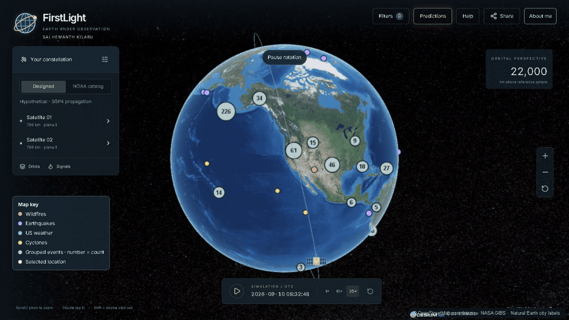
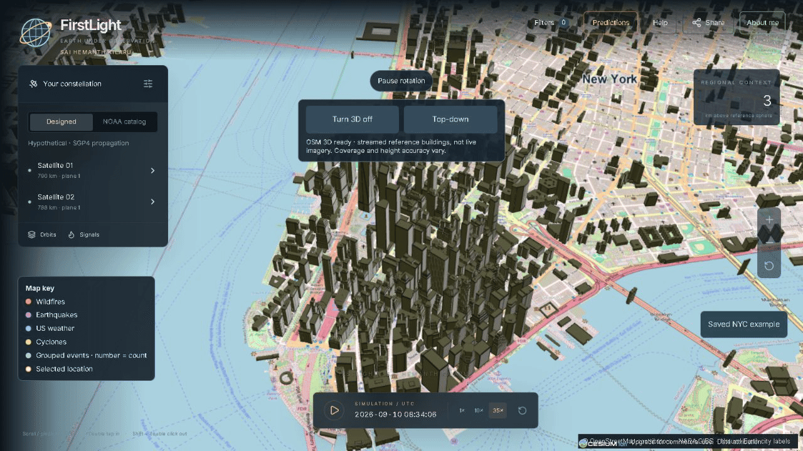

# FirstLight — Earth Under Observation

**SAI HEMANTH KILARU · Geospatial software and data engineering portfolio**

[Live globe](https://firstlight-sai-hemanth-kilaru-geo-vercel.vercel.app/) · [Technical overview](OVERVIEW.md) · [Hosting design](HOSTING_CHALLENGE.md) · [Backend source](backend/)

FirstLight connects reported natural events, historical exploration, fire-weather outlooks, modeled satellite access, and streamed 3D buildings in one globe-to-street interface.

## Fresh deployment recordings

[Higher-color globe video](globe-2026.mp4)

[Higher-color city video](city-2026.mp4)

Captured from the public deployment on September 10, 2026 at 1280 × 720. Approximately 11–13 seconds each; capture sampled roughly 9–11 frames/second, not a 60-FPS performance benchmark. The globe GIF is downsampled to 960 × 540 at 8 FPS for repository loading; MP4 retains the full capture dimensions. No generated in-between frames or blended interpolation. GIF has limited color; MP4 retains more detail. Recordings document captured states, not current conditions.

## What it tracks

| Layer | Source / method | Boundary |
| --- | --- | --- |
| Wildfire reports | NASA EONET | Curated events, not every ignition |
| Earthquakes | USGS | Selected feed/date limits |
| US weather alerts | National Weather Service | US coverage |
| Cyclone reports | GDACS | Provider-reported information |
| Space weather | NOAA SWPC | Provider conditions |
| Fire-weather danger | ECMWF through Copernicus GWIS | Seven future days; not ignition probability |
| Experimental fire rankings | NOAA GOES-18 + Open-Meteo; FirstLight ML | Eligible western-US active-fire cells only |
| Satellite orbits/access | satellite.js / SGP4 | Modeled geometry, not live telemetry |
| 3D buildings | Cesium OSM Buildings | Reference geometry; coverage/heights vary |
| Maps | NASA GIBS, OSM, Natural Earth | Reference imagery, street tiles, city labels |

Date filters, replay, source links, shareable exploration URLs, mobile controls, keyboard help, and reduced-motion behavior support the workflow.

## Free-tier-first engineering

The demo uses free-access APIs/open data and Vercel Hobby, Render Free, and Cesium ion Community. **No paid data subscriptions are required by this setup.** It is designed for a $0 recurring service bill within plan allowances—not an audited lifetime-spending claim or unlimited-free guarantee.

- Cesium account allowance observed: 15 GiB streaming. Buildings are opt-in below 15 km, pause above that altitude or in hidden tabs, and disable hidden/flight preloading. Memory bounds are not a monthly bandwidth hard cap.
- Render can sleep. The last successful prediction snapshot remains available while a visitor-triggered refresh runs. There is no promise of continuous background calculation.
- The interface checks feeds every five minutes while open; provider publication schedules are independent.
- Vercel Hobby and Cesium Community have personal/non-commercial eligibility limits.

**Stack:** Next.js, React, TypeScript, CesiumJS, satellite.js/SGP4, H3, Python/FastAPI, Docker, Vercel, Render, and private GitHub snapshot storage.

The engineering distinction is the integration: timestamps separate retrieval from source publication; reports, forecasts, and simulations remain distinct; stale results survive failed refreshes; 3D streams on demand. The [hosting case study](HOSTING_CHALLENGE.md) documents the actual Render → private snapshot repository → Vercel path and its limits.

See the [backend API reference](BACKEND_API.md), [selected backend](backend/), and [camera sample](samples/explorer-motion.ts). Full UI source, credentials, model artifacts, and training data remain private. Browser-delivered assets are necessarily visible to visitors.

## About me

Open to software engineering, geospatial, and data engineering opportunities.

[Résumé](SAI-HEMANTH-KILARU-Resume.pdf) · [LinkedIn](https://www.linkedin.com/in/sai-hemanth-kilaru/) · [Collaborate](mailto:skilaru@arizona.edu?subject=FirstLight%20collaboration)

## Sources and limits

[NASA EONET](https://eonet.gsfc.nasa.gov/docs/v3) · [USGS feeds](https://earthquake.usgs.gov/earthquakes/feed/v1.0/geojson.php) · [NWS API](https://www.weather.gov/documentation/services-web-api) · [GWIS methodology](https://gwis.jrc.ec.europa.eu/about-gwis/technical-background/fire-danger-forecast) · [Cesium plans](https://cesium.com/platform/cesium-ion/pricing/) · [Render Free](https://render.com/docs/free) · [Vercel Hobby](https://vercel.com/docs/plans/hobby)

Current-year ML performance remains unvalidated. Fire-weather danger is not ignition probability. Satellite geometry excludes clouds, daylight, sensor capability, and downlink. Worldwide coverage is incomplete. Forecast issue-time is unavailable in the current provider-map integration and disclosed in the UI.

© 2026 SAI HEMANTH KILARU. Original code, interface, writing, and recordings: all rights reserved unless separately licensed. Third-party data and libraries retain their licenses and attribution. Research portfolio—not emergency guidance.
